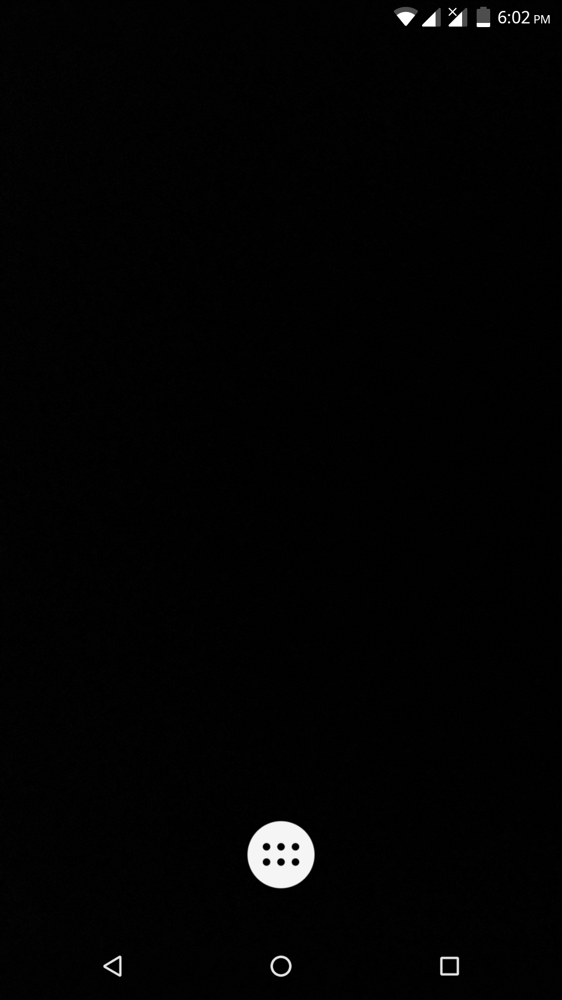
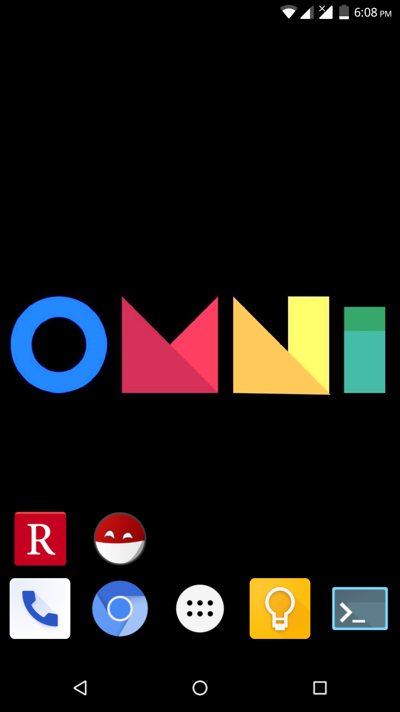
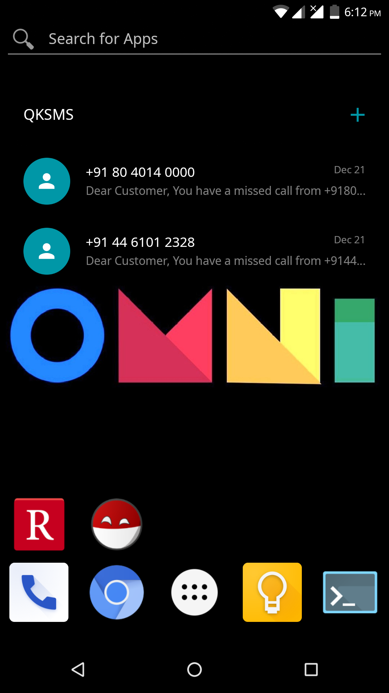
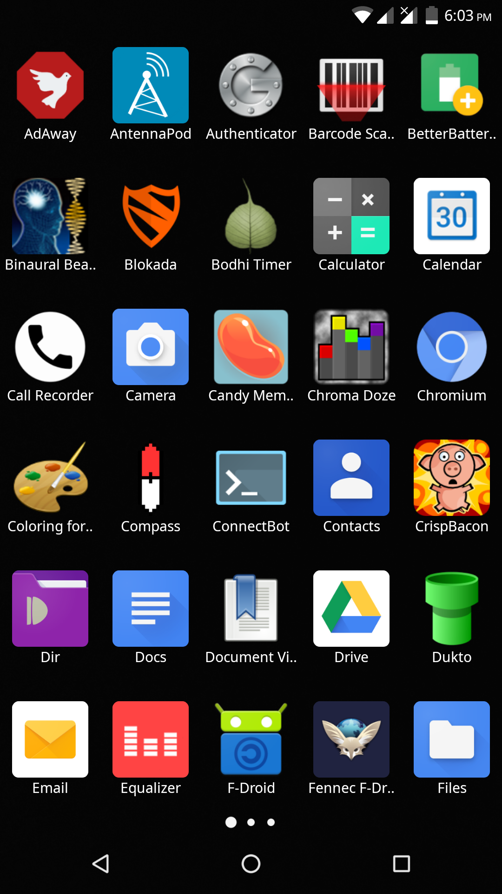
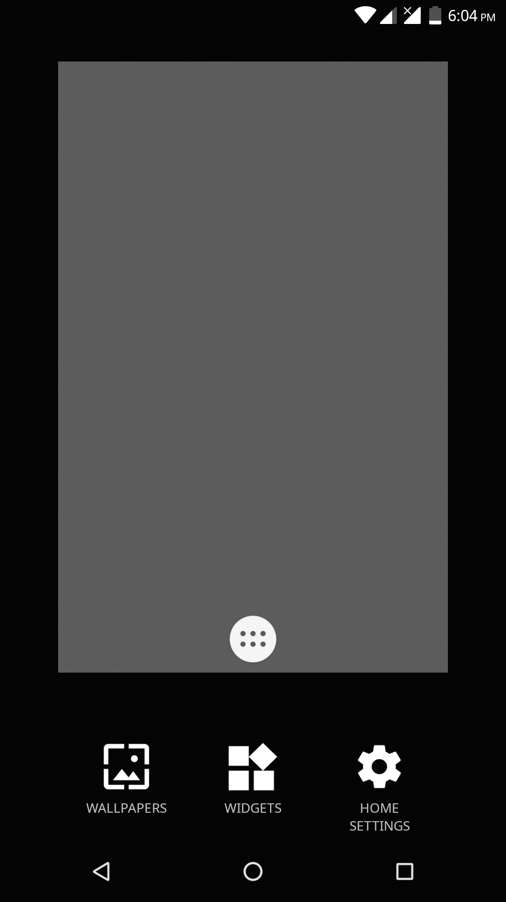
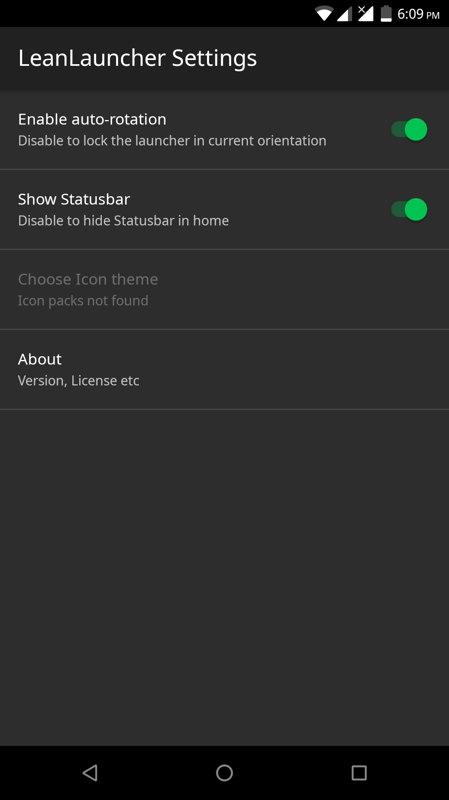

LeanLauncher
============

Minimal, single workspace launcher forked from AOSP's [Launcher 3](https://android.googlesource.com/platform/packages/apps/Launcher3/). Removes 'fluff' and clutter from Launcher 3, adding a few useful features.
Inspired by launchers like [Smart Launcher](https://play.google.com/store/apps/details?id=ginlemon.flowerfree).

Why
---
Because I was bored on a weekend(okay, several weekends) and frustrated with launchers adding more stuff I have no use far. 

Screenshots
-----------
* Startup - no icons, no widgets, just emptiness

  

[screenshots/startup.png]

* After adding some launchers and a wallpaper

  

* Adding some fancy widgets + our own app search widget

  

* App drawer

  

* Home screen configuration options

  

* Other launcher settings

  

Features/Changelog
=========

* Migrated Launcher 3 to Android Studio/gradle project setup
* A simple app search widget which doesn't need an internet connection to search your locally installed apps ;)
* Support for Icon themes
* Support for Swipe gestures
* Removed extraneous permissions
* Removed workspaces. One workspace ought to be enough for everybody!
* Removed Hotseat/"dock"
* Removed folder support
* Removed built-in wallpaper manager. You can still set wallpapers using an external app like G!Photos 
* Removed Backup settings to SD card. There is not much to backup anyway
* Removed migration from old launcher settings
* Removed welcome/first-run setup wizard
* Removed OEM support for launcher customisation
* Removed hard-coded support for Quick search bar(Google search)
* Apps will not be added to launcher on install, because of limited workspace
* Basic performance optimizations and code cleanup from running Android lint
* Cleaned up project resources

Credits
=======

Forked from Launcher3 at https://android.googlesource.com/platform/packages/apps/Launcher3
Launcher icon from Material icons project + Android Asset Studio

Todo
====

- [ ] icon loading polish: icon masking
- [ ] sd card boot thing: perf issue + apps disappearing 
- [ ] Add some tests maybe(...said every lazy dev ever)
- [ ] All apps: categories/sort order support
- [ ] Better landscape support
- [ ] App specific prefs: Hide app, choose icon, double-click action
- [ ] Use a less complicated model/db
- [ ] Simple gesture support: swipe to all apps, recent tasks
- [ ] Add more Preferences: icon customisation(rings, mono-color, normalize), layout cells?, all apps button tap behavior, hide

License
=======

    Copyright (C) 2015 Kumaresan Rajeswaran

    Licensed under the Apache License, Version 2.0 (the "License");
    you may not use this file except in compliance with the License.
    You may obtain a copy of the License at

        http://www.apache.org/licenses/LICENSE-2.0

    Unless required by applicable law or agreed to in writing, software
    distributed under the License is distributed on an "AS IS" BASIS,
    WITHOUT WARRANTIES OR CONDITIONS OF ANY KIND, either express or implied.
    See the License for the specific language governing permissions and
    limitations under the License.

